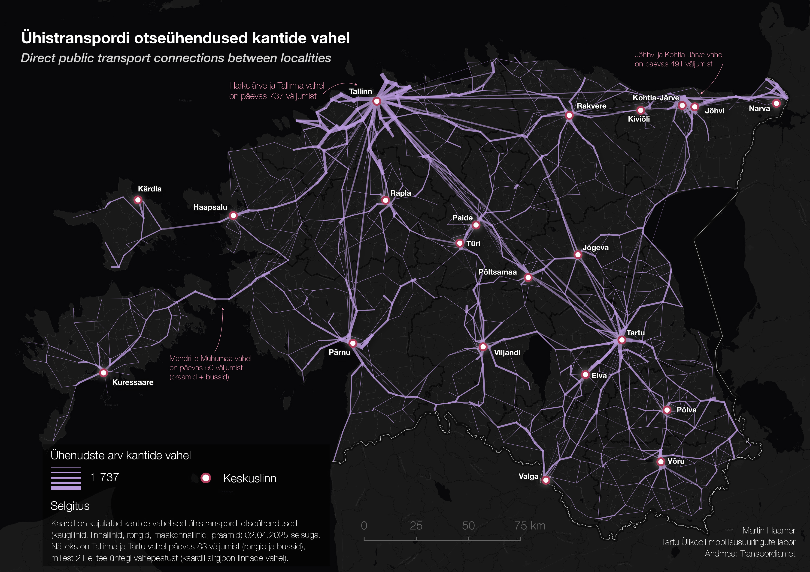

# Linking Public Transport Provision to Functional Regions: Evaluating Transport–Commuting Alignment in Estonia

Code and outputs for the study by Martin Haamer and Anto Aasa on the alignment between Estonia’s public transport network and commuting-based functional regions.

## Overview

This repository documents the methodology of the paper, with the analysis code, input data and derived outputs:

**Haamer, M. and Aasa, A.** (2026). *Linking Public Transport Provision to Functional Regions: Evaluating Transport–Commuting Alignment in Estonia.* AGILE GIScience Series, 7, 24. [https://doi.org/10.5194/agile-giss-7-24-2026](https://doi.org/10.5194/agile-giss-7-24-2026)

Article: [agile-giss.copernicus.org/articles/7/24/2026](https://agile-giss.copernicus.org/articles/7/24/2026/)

For one typical weekday (Tuesday 15 April 2025) the analysis detects direct public transport (PT) trips between Estonian localities (EE: *kant*), measures the service from each locality to its designated commuting centre (EE: *toimepiirkonna keskus*), and checks whether PT connects localities to the centre they commute to.

## Example: direct PT connections between localities



Map made in QGIS from `results/pt_adjacent_links.gpkg` (layers `adjacent_links` and `non_adjacent_links`). Each line joins the representative stops of two localities that a bus, train or ferry travels between without stopping in another locality; line width shows the number of daily services (1–737), for all PT types (long-distance, city and county buses, trains, ferries). For example, 83 trips run between Tallinn and Tartu per day, 21 of them without an intermediate stop (the straight line between the two cities). The busiest links are Harkujärve–Tallinn (737 services per day) and Jõhvi–Kohtla-Järve (491).

## Repository structure

```
scripts/
  PT_commute_comparison.R   main analysis
  validate_locality.R       per-locality check of all trips to/from the centre
  as_published/             scripts as used for the published article
data/
  GTFS/gtfs_2025_04/gtfs/   national GTFS feed, April 2025
  localities/localities.gpkg  locality polygons with commuting-centre assignment
results/                    outputs of PT_commute_comparison.R
figures/                    example map
```

## Data

| File | Content | Source |
|---|---|---|
| `data/GTFS/gtfs_2025_04/gtfs/` | Public transport schedules (GTFS) | Estonian Transport Administration (Transpordiamet), open data |
| `data/localities/localities.gpkg` | 840 locality polygons (EPSG:3301) with code (`CODE`), name (`KANT_NI`), commuting centre (`keskus`) and its code (`keskus_CODE`) | Derived from the functional regions dataset of the “Eesti 2050” national planning process |

The functional regions dataset itself is not publicly available. This repository includes only the locality boundaries and their commuting-centre assignment. Population, employment and commuting-share attributes are not included; the corresponding output columns (`population`, `workers`, `share_to_center`) are therefore empty. If you have access to the full dataset, point `toimepiirkonnad_gpkg` in the script’s CONFIG section to it and these columns are filled in.

## How to run

Requirements: R with the packages `tidyverse`, `sf` and `scales`.

Run from the repository root (all paths are relative):

```bash
Rscript scripts/PT_commute_comparison.R
```

This takes several minutes and writes the files in `results/`.

To inspect one locality in detail (all outbound and inbound trips, with QGIS layers):

```bash
Rscript scripts/validate_locality.R            # asks for a locality name or code
Rscript scripts/validate_locality.R K372       # or give codes/names directly
```

The validation script uses `results/pt_validation_inputs.rds`, which is created by the main script, so run that first.

## Method in brief

1. Keep GTFS services active on the target date and assign stops to localities.
2. For each trip, build the ordered sequence of localities it serves and all forward origin–destination pairs.
3. Count trips per locality pair; find each locality’s top PT destination and the number of trips departing from it.
4. For trips from a locality to its commuting centre: travel time, frequency, service span and arrivals in the AM peak (07:00–09:00).
5. Count PM return trips from the centre to the locality (departing 15:00–19:00).
6. Compare with the commuting-centre assignment: does the top PT destination match the centre, and is a round trip (AM arrival + PM return) possible?

Method choices:

- A trip counts once per locality pair, however many stops it makes in a locality.
- Stops with the same name within 250 m of each other are treated as one stop.
- Stops just outside all locality polygons (e.g. harbour piers) are assigned to the nearest locality within 50 m; stops abroad (e.g. Valka bus station, 99 m from Valga) are left out.
- Travel time to the centre is measured to the centre stop with the most incoming services from the centre’s localities (usually the bus station).
- On loop routes that pass the origin stop twice before reaching the centre, the last visit is used.
- Trips of 240 minutes or more are excluded from the centre metrics.
- Neighbouring localities are polygons within 1 m of each other.
- Lines in the spatial outputs connect representative stops: the stop of each locality with the most services on the target date (for a group of nearby same-name stops, their mean position).

## Outputs

| File | Content |
|---|---|
| `pt_commute_comparison.csv` / `.gpkg` | One row per locality: top PT destination, trips to the centre, share of departing trips reaching the centre, travel time and frequency statistics, AM/PM service and round-trip feasibility |
| `locality_stop_service_rankings.csv` | Stops of each locality ranked by number of services, with representative stops |
| `pt_connections_lines.gpkg` | Lines between the representative stops of every pair of localities connected by PT, with trip counts in both directions |
| `pt_adjacent_links.gpkg` | Lines between the representative stops of neighbouring localities with the number of services moving directly between them (style line width by `n_services_total` in QGIS) |

Main columns of `pt_commute_comparison.csv`:

| Column | Meaning |
|---|---|
| `kant_CODE`, `kant_name` | Locality code and name |
| `keskus_CODE`, `keskus_name` | Assigned commuting centre |
| `top_pt_dest`, `n_trips_to_top` | Locality with the most direct trips from this locality, and the number of trips |
| `total_outbound_trips` | Trips departing from the locality to any other locality |
| `n_trips_to_keskus`, `prop_to_keskus` | Trips to the centre, and their share of departing trips |
| `pt_matches_commute` | Top PT destination is the commuting centre |
| `median_travel_time_min` | Median travel time to the centre |
| `avg_frequency_min` | Average interval between departures to the centre |
| `am_peak_services` | Trips arriving at the centre 07:00–09:00 |
| `pm_return_services` | Trips from the centre to the locality departing 15:00–19:00 |
| `return_feasible` | Both an AM arrival and a PM return exist |
| `is_center` | Locality is itself a commuting centre |

## Differences from the published article

The code in `scripts/` has been revised since the article was published. The scripts that produced the published results are kept unchanged in `scripts/as_published/`.

The revision corrects how trips to the commuting centre are counted and timed:

- A trip with several stops in the origin locality was counted once per stop; it now counts once.
- On loop routes passing the origin stop twice, travel time was measured from the first pass; it is now measured from the last.
- Travel time is measured to the centre stop with the most incoming services from the centre's localities, instead of the last centre stop on the trip.
- Harbour stops just outside the locality polygons (e.g. Heltermaa) were dropped; they are now assigned to the nearest locality.

The alignment and minimum-service results are essentially unchanged. The travel-time results (Section 3.2, Table 3, Fig. 3) change:

| Result in the article | Published | Revised code |
|---|---|---|
| Localities with PT aligned to the commuting centre | 365 (44.5%) | 366 (44.7%) |
| Localities with minimum level of service | 566 (69.1%) | 568 (69.4%) |
| Non-centre residents without minimum service | 12.4% | 12.3% |
| Localities without direct PT to the centre | 170 (20.8%) | 169 (20.6%) |
| **Median travel time to the centre** | **43 min** | **34.5 min** |
| Residents within 15 min of their centre | 6.3% (55 localities) | 16.6% (108 localities) |
| Residents more than 60 min from their centre | 17.8% | 13.0% |

## Use of generative AI

AI tools (Claude) were used in developing this repository: for structuring the code of the original analysis, revision, implementing the corrections listed in [Differences from the published article](#differences-from-the-published-article), and drafting documentation. All methodological decisions were made by the authors, and the results were checked by the authors against the GTFS data.

## Citation

If you use this repository, please cite the associated paper and the archived repository release:

> Haamer, M. and Aasa, A.: Linking Public Transport Provision to Functional Regions: Evaluating Transport–Commuting Alignment in Estonia, AGILE GIScience Ser., 7, 24, https://doi.org/10.5194/agile-giss-7-24-2026, 2026.

See `CITATION.cff` for citation metadata.

## License

The code is released under the MIT License (see `LICENSE`). The input data are subject to the terms of their original providers (see [Data](#data)).

## Contact

Martin Haamer  
Mobility Lab, Department of Geography, University of Tartu, Tartu, Estonia
